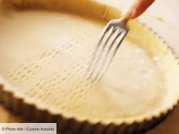

# Pâte brisée

## Ingrédients

+ 250 g farine
+ 0,8 dl beurre fondu
+ 0,8 dl d'eau

## Marche à suivre
1. Mettre le tout dans 1 bol.
2. Ne pas pétrir.
3. Ajouter un peu de farine si trop humide, un peu de beurre fondu ou de l'eau si trop sec.
4. Faire une boule et étaler

